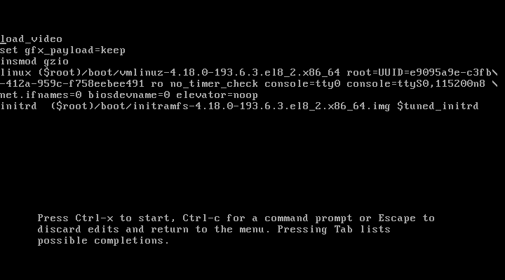
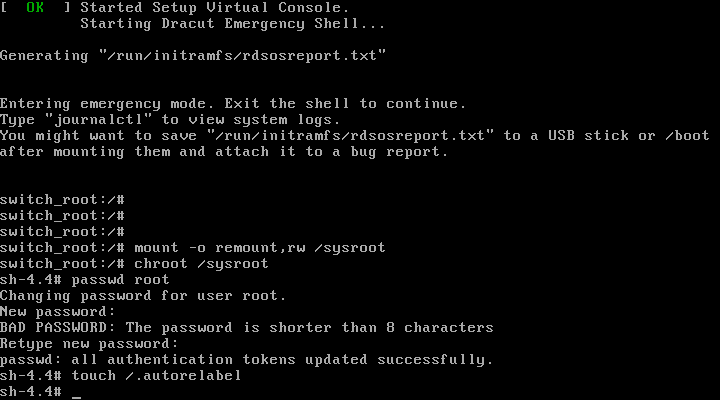
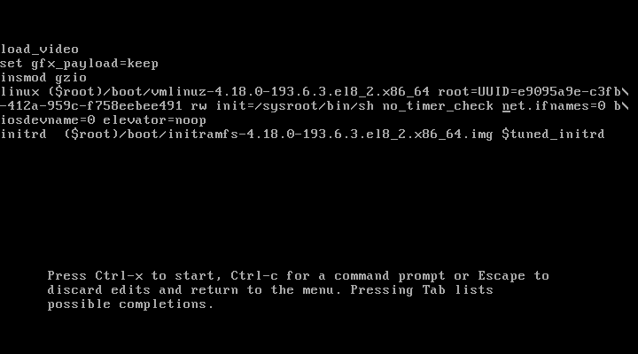

# ДЗ 5 по лекции "Загрузка системы"

## Задание

Работа с загрузчиком

* [Попасть в систему без пароля несколькими способами](#password)
    * [Способ 1. `init=/bin/sh`](#way1)
    * [Способ 2. `rd.break`](#way2)
    * [Способ 3. `rw init=/sysroot/bin/sh`](#way3)
* [Установить систему с `LVM`, после чего переименовать `VG`](#lvm)
* [Добавить модуль в `initrd`](#initrd)
* 4(*). Сконфигурировать систему без отдельного раздела с `/boot`, а только с `LVM`. Репозиторий с пропатченым grub: https://yum.rumyantsev.com/centos/7/x86_64/ PV необходимо инициализировать с параметром --bootloaderareasize 1m.

Критерии оценки:
Описать действия, описать разницу между методами получения шелла в процессе загрузки. Где получится - используем script, где не получается - словами или копипастой описываем действия

## Описание решения

В качестве стенда будем использовать `Vagrant`-стенд из прошлого задания, расположенный по [адресу](https://github.com/nixuser/virtlab/tree/main/zfs). Уберем в нем секцию провижининга `ZFS` за ненадобностью.

### Попасть в систему без пароля несколькими способами <a name="password"></a>
Все три способа, которые мы рассмотрим, реализуются через редактирование параметров загрузки системы. Нажмем клавишу `e` при выборе варианта загрузки, чтобы отредактировать параметры. После редактирования параметров нужно нажать `Ctrl-x` для загрузки в систему. Эти параметры применятся единоразово. Если нужно изменить параметры на постоянной основе - нужно переконфигурировать `Grub`.\
Пример редактирования параметров:



#### Способ 1. `init=/bin/sh` <a name="way1"></a>
В предпоследней строке, начинающийся с `linux`, удалим блок `console=tty0 console=ttyS0,115200n8`. Допишем в конце `init=/bin/sh` и загрузимся в систему. Мы попали в систему как пользователь `root`, в чем легко убедиться, выполнив команду:
```
sh-4.4# whoami
root
```
Файловая система находится в режиме `read-only`, чтобы это исправить можно перемонтировать её:
```
sh-4.4# mount -o remount,rw /
```

#### Способ 2. `rd.break` <a name="way2"></a>
Аналогично пункту выше, удаляем блоки с `console=*` и дописываем в конце `rd.break`. Таким образом мы остновимся в момент загрузки `initrd`, корневая файловая система будет смонтирована в `/sysroot`.\
Выполним следующие команды, чтобы перемонтировать файловую систему в режиме `rw` и сменить пароль рута:
```bash
mount -o remount,rw /sysroot
chroot /sysroot
passwd root
touch /.autorelabel
```



Можно перезагружаться и воспользоваться измененным паролем.

#### Способ 3. `rw init=/sysroot/bin/sh` <a name="way3"></a>
Этот пункт похож на предыдущий вариант, только вместо дописывания `rd.break` в конце, заменим `ro` на `rw init=/sysroot/bin/sh`. Не забудем удлаить блоки с `console=*`.



Отличием является то, что файловая система уже смонтирована в режиме `rw`.

### Установить систему с `LVM`, после чего переименовать `VG` <a name="lvm"></a>

### Добавить модуль в `initrd` <a name="initrd"></a>